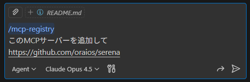

# ricoh-mcp-registry

r0098 の Organization で利用する MCP サーバーを管理するための MCP レジストリです。

## 概要

このリポジトリは [Model Context Protocol (MCP)](https://modelcontextprotocol.io/) サーバーのレジストリを提供します。GitHub Pages を通じて公開され、IDE や GitHub Copilot のカタログとして機能します。

## リポジトリ構成

```
.
├── .github/
│   ├── prompts/
│   │   └── mcp-registry.prompt.md  # Copilot 用プロンプト
│   └── workflows/
│       └── deploy.yml              # GitHub Pages デプロイ
├── docs/
│   └── v0.1/servers/
│       └── index.json              # MCP Registry エンドポイント
├── mcp-registry.json               # レジストリ定義ファイル
└── scripts/
    └── generate-registry-endpoints.js
```

## Copilot カスタムプロンプトの使い方

このリポジトリには、MCP Registry の管理を支援する Copilot 用プロンプトが含まれています。

### VS Code での使用方法

1. このリポジトリを VS Code で開く
2. GitHub Copilot Chat を開く（`Ctrl+Shift+I`）
3. `/mcp-registry` と入力
4. 追加したいMCPサーバーのURLを入力

   

### プロンプトの内容

`.github/prompts/mcp-registry.prompt.md` には以下の情報が含まれています:

- MCP Registry の JSON フォーマット仕様
- 必須/オプションフィールドの詳細
- レジストリ更新時の運用ルール
- セキュリティサーベイの実行手順

### 主な用途

- MCP サーバーの追加・更新・削除
- レジストリ JSON の正しいフォーマット確認
- 公式スキーマに準拠した設定の作成

## デプロイ

main ブランチへのプッシュ時に GitHub Actions が自動実行され、GitHub Pages にデプロイされます。

### エンドポイント

```
https://<org>.github.io/<repo>/v0.1/servers/
```
